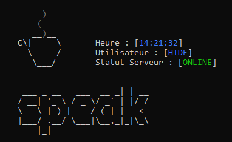

## Speak Project

<!-- PROJECT LOGO -->
<br />
<p align="center">
  <a href="https://github.com/Steraky/speak">
    
  </a>
  
<!-- ABOUT THE PROJECT -->
## About Speak

<br />
<p align="center">
  <a href="https://github.com/Steraky/speak">
    
  </a>

Info:
* Speak was coded by Steraky, so yes I'm the only developer on this project and the brain Ezbyk.
* It is the only messaging tool on terminal and without logs!

* the project director: ezBYK 
* the developer: Steraky 
### Coded With
* [Python](https://www.python.org/)

## Getting Started

### Prerequisites:

* ```Python3.x```
* ```pip3```
* ```git```

### Installation:

How to install :

* Linux

1. Clone the Github Repository
  ```
  git clone https://github.com/Steraky/speak
  ```
2. Go on the speak file
  ```
  cd speak
  ```
3. Install the requirements using pip
  ```
  pip3 install requierements.txt
  ```
4. Launch speak
  ```
  python3 speak.pyc
  ```

* Windows

1. Go on the speak file
  ```
  cd speak
  ```
2. Install the requirements using pip
  ```
  pip install requierements.txt
  ```
3. Launch speak
  ```
  python speak.pyc
  ```

## Need a Speak server ?

* Contact us on discord : hide#2000 && ezb3lovesh#0443

*          Our discord: https://discord.gg/6y9WBktEbw               
